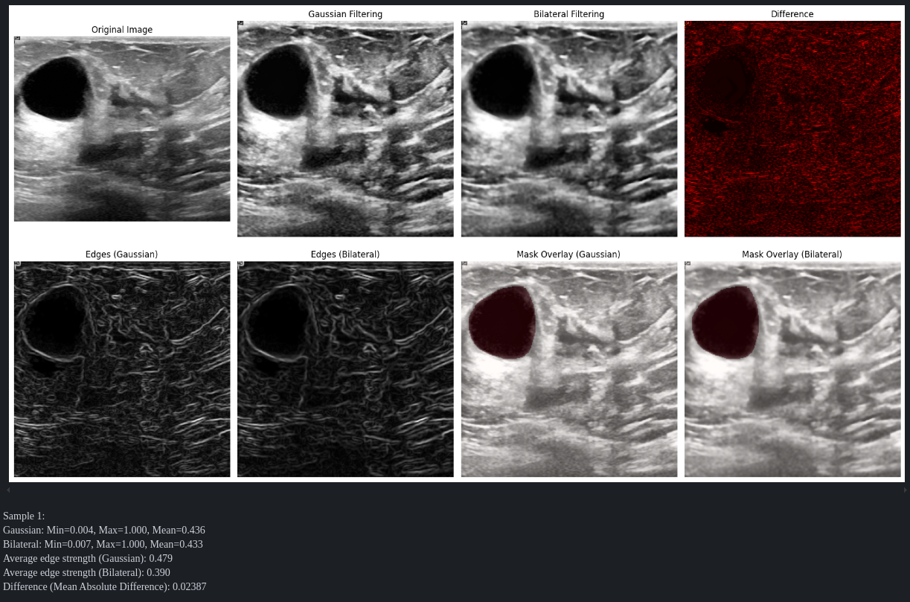
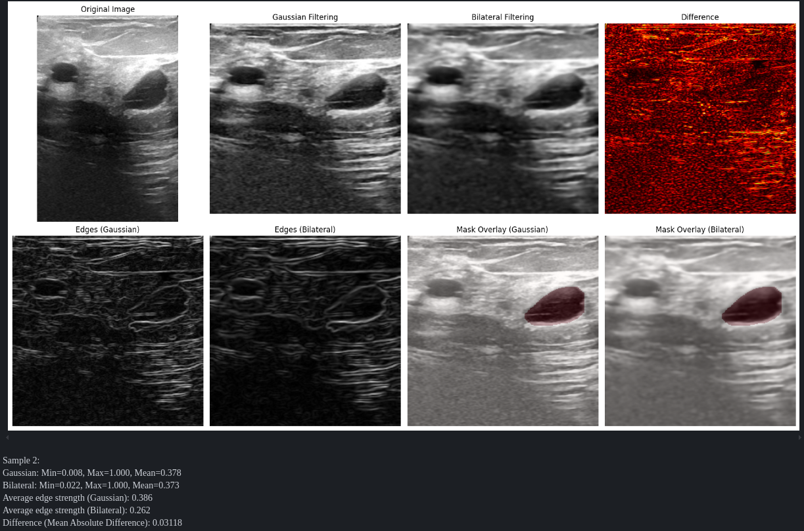

# 1. Dataset and Preprocessing

Dodałem filtr dwustronny, czyli postawiłem zastosować technikę wygładzania z zachowaniem krawędzi. Nie jest to rozwiązanie typu one-size-fits, można zastosować połączenie dwóch technik. Początkowo zastosować jeden ze specjalistycznych filtrów szumu plamkowego następnie technikę zachowania krawędzi np. filtr dwustronny.

Mając więcej czasu, przygotowałbym takie rozwiązanie i porównał działanie.

Ponadto, robiąc research do tego zadania nadtrawiłem na dokument [Speckle Noise Reduction in Ultrasound Images using Denoising Auto-encoder with Skip connection](https://arxiv.org/html/2403.02750v1). Auto enkodery z połączeniami pomijającymi (często określane jako architektury podobne do U-Net) oferują znaczące zalety w zakresie usuwania szumów z obrazów ultradźwiękowych, szczególnie w przypadku wdrażania urządzeń brzegowych.

**Wydajności:**

- Zmniejszona liczba parametrów: Połączenia pomijane umożliwiają płytsze sieci przy zachowaniu wydajności, zmniejszając ogólny rozmiar modelu.
- Szybsza konwergencja: Sieci z połączeniami pomijanymi zazwyczaj wymagają mniejszej liczby iteracji szkoleniowych.
- Mniejsze opóźnienie wnioskowania: Zoptymalizowana architektura umożliwia szybsze czasy przetwarzania — krytyczne dla aplikacji do obrazowania medycznego w czasie rzeczywistym.

**Dokładność:**

- Zachowane szczegóły: Połączenia pomijane pomagają zachować informacje o wysokiej częstotliwości (krawędzie, tekstury), które w przeciwnym razie zostałyby utracone w procesie kodowania.
- Lepsze radzenie sobie z szumem plamkowym: Badania pokazują, że połączenia pomijane są szczególnie skuteczne w przypadku charakterystycznego szumu plamkowego w obrazach ultrasonograficznych.

**Urządzenia brzegowe:**

- Wydajność pamięci: Połączenia pomijane zmniejszają potrzebę dużych map cech pośrednich, obniżając wymagania dotyczące pamięci RAM.
- Potencjał paralelizacji: Architektura dobrze nadaje się do sprzętowe przyspieszenie na specjalnych chipach dedykowanych przyśpieszeniu AI (Neural processing units (NPU)).
- Skalowalność: Liczbę połączeń pomijających można dostosować w zależności od możliwości urządzenia, co zapewnia dobrą równowagę między rozmiarem modelu a wydajnością.

Połączenia pomijające zasadniczo tworzą skróty w sieci, które umożliwiają łatwiejszy przepływ informacji gradientowych podczas treningu i zachowują informacje przestrzenne, które w przeciwnym razie zostałyby utracone w procesie kodowania-dekodowania. Jest to szczególnie cenne w przypadku obrazów ultrasonograficznych, w których zachowanie drobnych szczegółów anatomicznych przy jednoczesnym usuwaniu szumów jest niezbędne.

### Porównanie z klasycznymi metodami:
W porównaniu ze specjalistycznymi filtrami szumów pasmowych (Lee, Frost, Kuan)

**Zalety auto enkoderów:**

- Doskonałe zachowanie krawędzi: Połączenia pomijające zachowują szczegóły strukturalne, które filtry statystyczne często rozmywają.
- Lepsza adaptowalność: Możliwość uczenia się złożonych wzorców szumów specyficznych dla konkretnego sprzętu ultradźwiękowego.

**Wady:**

- Wymagania szkoleniowe: Potrzeba reprezentatywnych danych w przeciwieństwie do filtrów statystycznych, które działają „od razu”
- Bardziej intensywne obliczeniowo: Chociaż tu można na pewno zastosować jakieś techniki optymalizacji (kwantyzacja).

### W porównaniu z adaptacyjnym wyrównaniem histogramu:

**Zalety autoenkoderów:**

- Rzeczywiste usuwanie szumów, a nie tylko poprawa kontrastu.
- Zachowanie struktury: CLAHE może wzmacniać szumy wraz z użytecznymi cechy.
- Uzupełniające podejścia: Auto enkodery działają dobrze, gdy są stosowane z CLAHE.

**Wady:**

- Czas przetwarzania: CLAHE jest niezwykle szybki w porównaniu do rozwiązania z secią neuronową
- Prostota: CLAHE nie wymaga szkolenia

### W porównaniu do wygładzania z zachowaniem krawędzi:

**Zalety auto enkoderów:**

- Przetwarzanie uwzględniające treść: Uczy się, co stanowi szum, a co ważne cechy diagnostyczne.
- Hierarchiczne zachowanie cech: Połączenia pomijające zachowują szczegóły w wielu skalach.
- Lepsza wydajność w przypadku złożonych struktur anatomicznych.

**Wady:**

- Natura czarnej skrzynki: Mniej interpretowane niż techniki takie jak filtrowanie dwustronne
- Złożoność implementacji: Większe wyzwanie w implementacji i optymalizacji

Ocena ogólna
Autoenkodery z połączeniami pomijającymi zazwyczaj zapewniają lepszą jakość usuwania szumów, ale z większym narzutem obliczeniowym.

Najlepsze podejście często łączy metody — na przykład użycie autoenkodera do usuwania szumów, a następnie CLAHE do poprawy kontrastu.

**Dlaczego wybrałem filtrowanie dwustronne?**

1. Bardzo dobre zachowanie krawędzi
- Zachowuje granice anatomiczne, które są kluczowe dla diagnozy
- Zachowuje małe struktury, które inne filtry mogą eliminować
- Nieliniowa natura zachowuje ostre przejścia, wygładzając jednocześnie jednorodne obszary
1. Rozsądne wymagania obliczeniowe
- Można je optymalizować za pomocą technik aproksymacji dla urządzeń brzegowych
- Biblioteki oferują zoptymalizowane implementacji np. OpenCV
1. Brak konieczności szkolenia
- Działa „od razu” bez zbierania danych do treningu
- Parametry można dostroić na podstawie charakterystyki szumu
1. Szczególne zalety dla obrazów ultrasonograficznych
- Radzi sobie z szumem plamkowym lepiej niż filtrowanie Gaussa
- Zachowuje informacje o teksturze lepiej niż filtrowanie medianowe
- Zachowuje lepsze zróżnicowanie tkanek niż filtry Lee lub Frost

Znalazłem informację, że użycie filtru dwustronnego daje 70-80% tego co dałoby zastosowanie auto enkodera a jednocześnie wymaga znaczniej mniej zasobów obliczeniowych. 

## Testy (na podstawie 01_preprocessing_compare.ipynb)

Próbka 1:

- Filtrowanie Gaussa wykazuje **22,8% większą siłę krawędzi** (0,479 w porównaniu do 0,390)
- Wartości pikseli różnią się średnio o 0,02387 (około 2,4% pełnego zakresu intensywności)
- Obie metody dają podobną ogólną jasność (średnia 0,436 w porównaniu do 0,433)

Próbka 2:

- Jeszcze większa różnica w sile krawędzi - **47,3% wyższa w przypadku Gaussa** (0,386 w porównaniu do 0,262)
- Różnice w pikselach wynoszą średnio 0,03118 (około 3,1% pełnego zakresu intensywności)
- Ponownie, podobne poziomy jasności (0,378 w porównaniu do 0,373)

W obu próbkach filtrowanie dwustronne jest wyraźnie bardziej agresywne w redukcji tego, co uważa za szum, jednocześnie będąc bardziej selektywnym w kwestii tego, które krawędzie zachowuje. Istotna różnica w metrykach siły krawędzi (szczególnie w Próbce 2) wskazuje, że filtrowanie dwustronne podejmuje bardziej niuansowe decyzje dotyczące tego, co stanowi znaczącą krawędź.

W przypadku segmentacji ultrasonograficznej w medycynie ta selektywność filtrowania dwustronnego jest cenna, ponieważ:

1. Redukuje szum plamkowy, który mógłby tworzyć fałszywe granice
2. Zachowuje silniejsze krawędzie anatomiczne, które reprezentują rzeczywiste przejścia tkankowe
3. Spójność między próbkami sugeruje, że to zachowanie jest niezawodne

