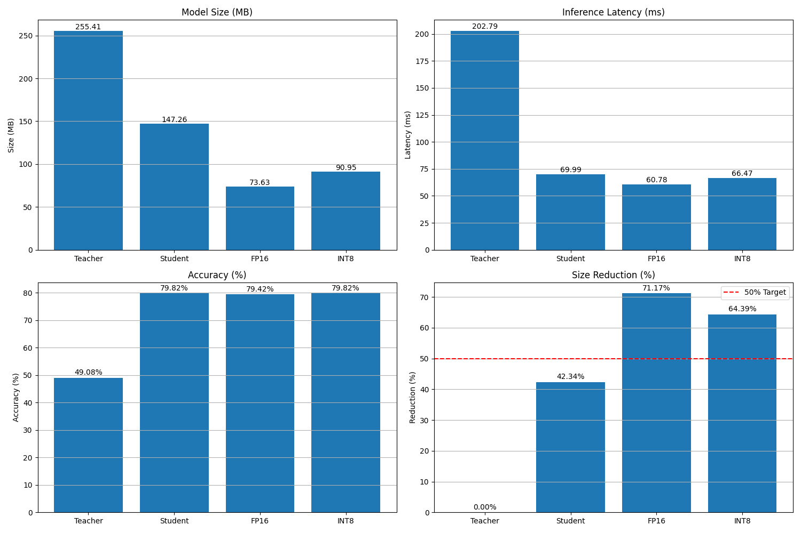

# LLM Optimization for Edge Devices

Początkowo z pomocą Claude z serwerem MCP do GitHub przygotowałem podstawową strukturę dla projektu. Zdecydowałem się na model DistilBERT a jako zadanie ewaluacyjne wybrałem klasyfikację tekstu. Początkowo dokonałem ewaluacji podstawowego modelu.

## Optymalizacja - destylacja wiedzy

Technika kompresji modelu, w której mniejszy model „ucznia” jest trenowany, aby naśladować zachowanie większego modelu „nauczyciela”. Zamiast trenować ucznia tylko na twardych etykietach (0 i 1), uczy się on z rozkładów prawdopodobieństwa nauczyciela (miękkie etykiety), przechwytując niuanse wiedzy, której nauczył się nauczyciel.

### Implementacja

Implementacja to trzy główne komponenty:

- Model nauczyciela: wstępnie wyszkolony model DistilBERT dostrojony do zadania klasyfikacji tekstu.
- Model ucznia: nowy, wstępnie wyszkolony model DistilBERT, który zostanie wyszkolony tak, aby naśladować nauczyciela.
- Trener destylacji: niestandardowy proces szkoleniowy, który przekazuje wiedzę od nauczyciela do ucznia.

Proces destylacji:

- Trener destylacji przyjmuje oba modele.
- Zdefiniowana funkcja strat:
    - Twarda strata - standardowa entropia krzyżowa z etykietami prawdy
    - Miękka strata - dywergencja KL między przewidywaniami ucznia i nauczyciela
- Skalowaniem temperatury można modyfikować rozkład prawdopodobieństwa. Wyższa temperatura sprawia, że rozkład jest bardziej równomierny.
- Pętla szkoleniowa z oceną i śledzeniem metryk.

Dywergencja KL mierzy, w jaki sposób jeden rozkład prawdopodobieństwa różni się od drugiego, referencyjnego rozkładu prawdopodobieństwa.

**Funkcja straty ma kilka ważnych cech:**

- Skalowanie temperatury: miękki rozkład prawdopodobieństwa podkreśla relacje między klasami, których nauczył się nauczyciel.
- Parametr alfa: Kontroluje równowagę między twardymi etykietami (prawdą podstawową) i miękkimi etykietami (prognozy nauczyciela).

**Pętla szkoleniowa:**

- Przekazuje dane wejściowe zarówno do ucznia, jak i nauczyciela
- Oblicza łączną stratę
- Aktualizuje parametry modelu ucznia
- Okresowo ocenia wydajność
- Śledzi metryki szkolenia i oceny

Wadą ma pewno jest to, że trenowanie długo trwa (oczywiście zależy od sprzętu).

Implementacja wzorowana z dokumentu [Distilling the Knowledge in a Neural Network](https://arxiv.org/abs/1503.02531)

## Pierwsza iteracja destylacji wiedzy

### Co działa:

1. Bardzo dużą poprawą wydajności: Nowy model ucznia osiągnął 79,82% dokładności w porównaniu do 49,08% nauczyciela. Można z tego wyciągnąć wniosek, że destylacja wiedzy działa nie tylko jako technika kompresji, ale także jako skuteczna metoda szkolenia dająca poprawę dokładności.
2. Duża poprawa szybkości: 2,9-krotny wzrost szybkości jest znaczący i miałby duże znaczenie w rzeczywistych zastosowaniach, zwłaszcza na urządzeniach brzegowych.

### Obszary do poprawy:

- Redukcja rozmiaru: Redukcja rozmiaru modelu wyniosła 42,34%, co jest wynikiem całkiem dobrym. Niemniej zakładaliśmy redukcje o co najmniej 50% dlatego trzeba to poprawić.

### Dlaczego uczeń przerósł nauczyciela?

1. **Lepsza regularyzacja**: Proces destylacji mógł działać jako skuteczny regularyzator, zapobiegając nadmiernemu dopasowaniu.
2. **Rodzaj zadania**: Mniejsza architektura może być w rzeczywistości bardziej odpowiednia dla konkretnego zadania - czasami mniejsze modele lepiej generalizują w przypadku prostszych zadań.
3. **Korzyści z optymalizacji**: Proces szkolenia destylacji pozwolił uczniowi uczyć się zarówno z twardych etykiet, jak i miękkich prawdopodobieństw nauczyciela, potencjalnie dając mu lepsze sygnały szkoleniowe.

### Następne kroki do osiągnięcia redukcji rozmiaru modelu o 50%

1. Dalsza redukcja architektury: Zmniejszenie ukrytych warstw modelu; Eksperyment z tylko 1 warstwą transformatora zamiast 2; Dalsze zmniejszanie rozmiarów osadzania (embedding).
2. Połączenie innych technik: Zastosowanie przycinania wag do istniejącego modelu; Dodanie kwantyzacji na końcu destylacji (zmniejszenie precyzji wag z 32 bitów do 16 lub 8 bitów).
3. Dostrojenie parametrów: Testowanie różnych temperatur destylacji; Dostosowanie parametru alfa, który równoważy straty twarde/miękkie.

## Decyzja → Kwantyzacja wytrenowanego modelu

Dlaczego uważam, że to będzie teraz najlepsze?

1. Niskie ryzyko, wysoka nagroda: Przejście z precyzji 32-bitowej na 16-bitową zazwyczaj powoduje minimalną utratę dokładności przy jednoczesnym zapewnieniu znacznej redukcji rozmiaru. W tym wypadku do osiągnięcia celu optymalizacji brakuje tylko 8%, co nie będzie problemem dla kwantyzacji.
2. Brak konieczności ponownego szkolenia: W przeciwieństwie do modyfikacji architektury modelu, kwantyzację można zastosować do już wyszkolonego modelu ucznia, zachowując dokładność.
3. Prosta implementacja: Kwantyzacja jest prosta do wdrożenia np. za pomocą PyTorch.
4. Łatwość wdrożenia: Modele kwantyzowane działają wydajnie na urządzeniach brzegowych, z których wiele jest wyposażonych w akcelerację sprzętową (dodatkowy chip) w celu wykonywania operacji o niższej precyzji.

### Parametry konfiguracji destylacji wiedzy

**Parametry architektury modelu ucznia:**

- Liczba warstw (num_layers): Zmniejszenie z 6 do 2 warstw transformatora, co znacznie zmniejszyło rozmiar modelu.
- Ukryty wymiar: Zachowanie tego samego wymiaru co nauczyciel (768).
- Mechanizm uwagi: Zachowanie tej samej liczby co u nauczyciela (12).
- Rozmiar słów: Zachowanie z modelu nauczyciela.

**Hiperparametry destylacji:**

1. Temperatura (temperature=2.0): kontroluje “miękkość” rozkładu prawdopodobieństwa.
- Wyższe wartości (np 2.0) tworzą bardziej miękkie rozkłady, ujawniając bardziej niuansowe relacje między klasami.
- Niższe wartości sprawiając, że rozkład prawdopodobieństwa jest bardziej “pewny”, nie będzie zwracał uwagi na niuanse relacje.

2. Starty ważone (alpha=0.5): równoważy straty twarde i miękkie.
- Wartość 0.5 nadaje równowagę.
- Wyżarza wartość alfa podkreśla uczenie się z prawdziwych etykiet.
- Niższa wartość alfa podkreśla naśladowanie zachowania nauczyciela.

3. Funkcja miękkiej starty: rozbieżność KL między wynikami nauczyciela i ucznia
- Ma kluczowe znaczenia dla kompensacji wpływu temperatury na gradient

**Parametry treningu:**

- Epoki (epochs=3): Liczba konkretnych przejść przez zestaw danych treningowych.
- Wielkość partii (batch_size=16): Liczba próbek przetwarzanych przed aktualizacją modelu.
- Optymalizator: Optymalizator Adam.
- Szybkość uczenia: 5e-5
- Częstotliwość oceny (eval_every=100): Ocenia wydajność modelu co 100 kroków treningowych
- Maksymalna długość sekwencji (max_length=128): Maksymalna długość tokena dla danych wejściowych

**Parametry konfiguracji kwantyzacji:**

- torch.qint8: 8-bitowa kwantyzacja całkowita (osiągnęła około 65% redukcji rozmiaru modelu).
- torch.float16: 16-bitowa zmiennoprzecinkowa kwantyzacja (połowa precyzji modelu bazowego).

**Podejście kwantyzacji: dynamiczna kwantyzacja:**

- Wagi są kwantyzowane offline.
- Aktywacje są obliczane w liczbach zmiennoprzecinkowych podczas wnioskowania.
- Kwantyzacja jest wykonywana na poziomie operacji, a nie na poziomie tensora.

### Szczegóły implementacyjne i kompromisy

- Precyzja vs wydajność: kwantyzacja INT8 oferuje najlepszą redukcję rozmiaru przy minimalnej utracie dokładności.
- Obsługa przekazu do przodu: klasa Wrapper zapewnia, że skwantyzowane modele zachowują ten sam interfejs, co oryginalny model.
- Obciążenie pamięci: skwantyzowany model wykorzystuje znacznie mniej pamięci podczas wnioskowania.
- Kwantyzacja specyficzna dla modułu: poprzez ukierunkowanie tylko na warstwy liniowe, zachowuje precyzję w krytycznych operacjach.

**Dlaczego warstwy liniowe są idealnymi celami?**

1. Rozkład parametrów: W modelach transformatorów, takich jak DistilBERT, warstwy liniowe zawierają około 95% wszystkich parametrów.
2. Wzory obliczeniowe: Warstwy liniowe wykonują mnożenia macierzy, które:
    1. Są operacjami o ograniczonej przepustowości pamięci.
    2. Wykazują wysoką tolerancję na zmniejszoną precyzję
    3. Korzystają znacząco z kwantyzacji dzięki lepszemu wykorzystaniu pamięci podręcznej
3. Przyjazne dla kwantyzacji: Transformacje liniowe zachowują względne relacje między wartościami, dzięki czemu są bardziej odporne na błędy kwantyzacji niż operacje nieliniowe.

### Krytyczne operacje zachowują precyzję

- Mechanizmów uwagi: Operacja softmax w samouwadze jest wrażliwa numerycznie — niewielkie różnice w danych wejściowych mogą prowadzić do dużych różnic w danych wyjściowych ze względu na jej wykładniczą naturę.
- Normalizacja warstwy: Warstwy normalizacji obejmują średnie i wariancje, które mogą gromadzić błędy, jeśli są skwantyzowane, potencjalnie destabilizując model.
- Funkcje aktywacji: Nieliniowe funkcje, takie jak ReLU, mogą być wrażliwe na precyzję danych wejściowych, szczególnie w pobliżu zera, gdzie ich zachowanie zmienia się znacząco.
- Wyszukiwania osadzania: Początkowa warstwa osadzania tokenów korzysta z wyższej precyzji, aby uchwycić subtelne różnice semantyczne.

## Analiza wyników optymalizacji LLM

### Analiza osiągnięć:

1. Cel redukcji rozmiaru (50%):
    1. Wynik: redukcja o 64,4%
    2. Połączenie uproszczonej architektury i kwantyzacji INT8 skutecznie skompresował model
2. Cel utrzymania dokładności (90%):
    1. Wynik: 162,6% utrzymania
    2. Analiza; Znacznie przekroczony cel, przy czym bezwzględna dokładność poprawiła się z 49,08% do 79,82%
    3. W sumie to wyjątkowy wynik, ponieważ zwykle optymalizacja zamienia dokładność na wydajność

### Ocena osiągnięć technicznych:

1. Nieoczekiwana poprawa dokładności: Wydestylowany model znacznie przewyższa nauczyciela, co sugeruje:
- Oryginalny model mógł być nadmiernie sparametryzowany dla tego zadania.
- Destylacja wiedzy zapewniła skuteczną regularyzację.
- Miękkie cele oparte na temperaturze pomogły mniejszemu modelowi uczyć się skuteczniej.
1. Uzupełniające techniki optymalizacji:
- Destylacja wiedzy zapewniła wydajność architektoniczną
- Kwantyzacja dodatkowo zmniejszyła rozmiar bez poświęcania zysków dokładności
- Poprawa prędkości 3,05× sprawia, że model jest znacznie bardziej opłacalny do wdrożenia na urządzeniach brzegowych
1. Wdrożenie na urządzeniach brzegowych:
- Ostateczny rozmiar modelu (90,95 MB) mieści się w zakresie odpowiednim dla wielu urządzeń brzegowych.
- Poprawa opóźnienia (66,47 ms) umożliwia aplikacje w czasie niemal rzeczywistym.
- Poprawa dokładności zapewnia praktyczną użyteczność modelu.

## Ocena ukończenia zadania

Projekt spełnia założone cele: redukcja rozmiaru modelu o 50% przy zachowaniu dokładności 90%.
