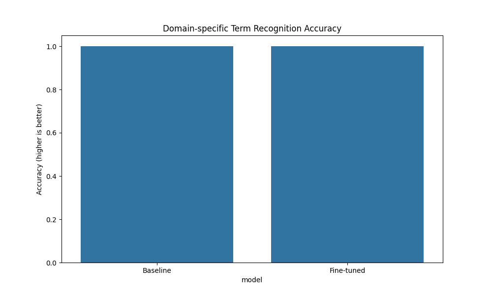
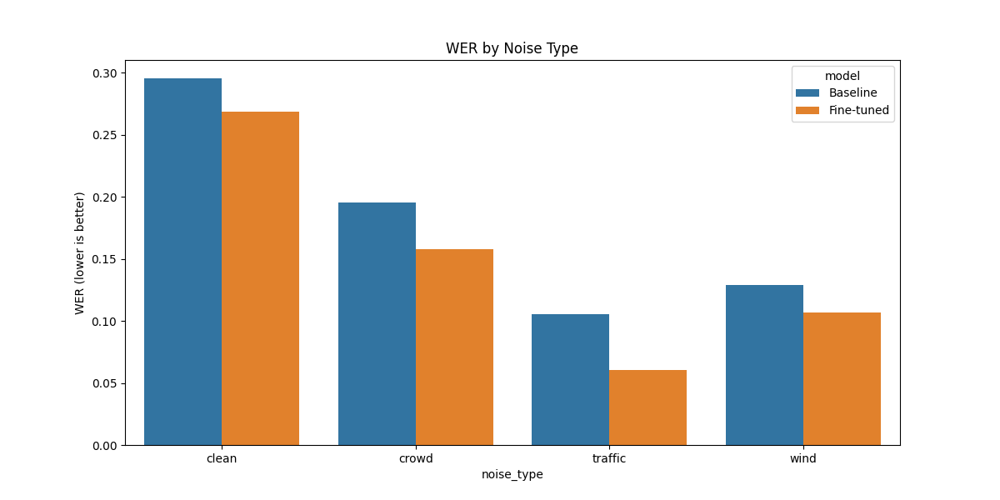
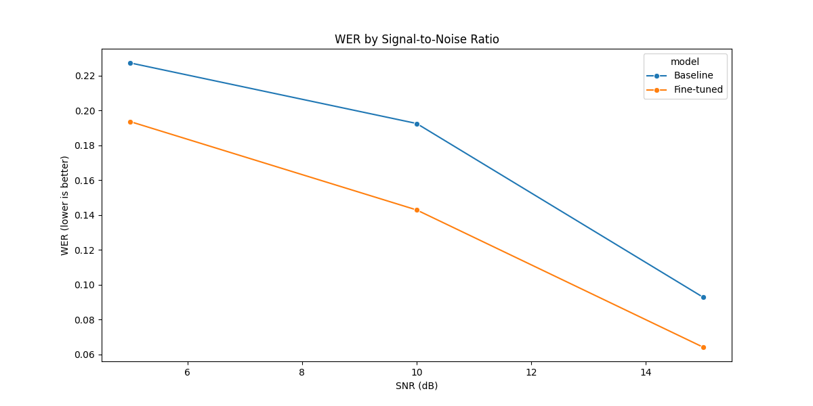
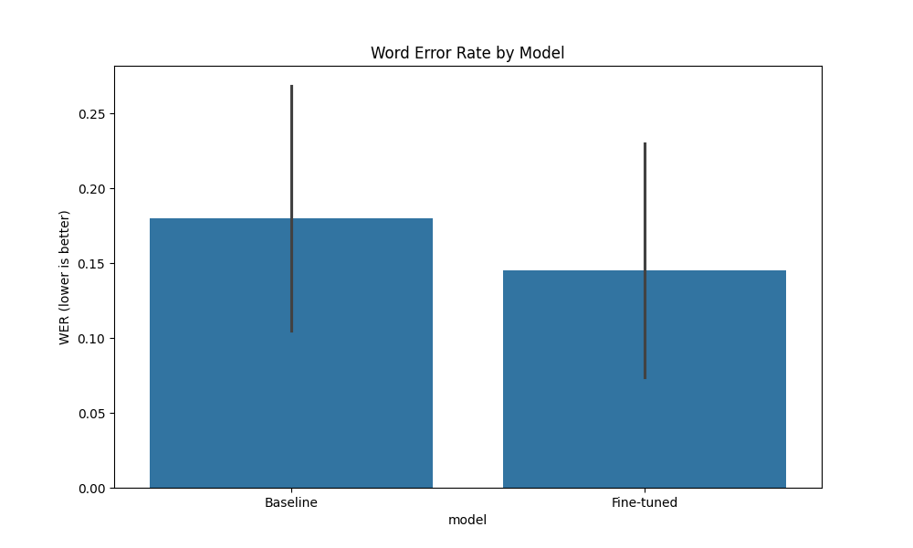

# Domain-Specific Speech Recognition in Challenging Environments

## Proces tworzenia zbioru danych rozpoznawania mowy specyficznego dla domeny

Zadanie rozpocząłem od przygotowania danych do treningu oraz walidacji modelu. 

### 1. Definicja frazy specyficznej dla domeny

Zdefiniowałem początkowo 15 zwrotów specyficznych dla domeny w pliku config.py

Frazy te obejmują:

- Kodeksy policyjne (10-31, 10-78)
- Terminologia proceduralna („postępowanie z ostrożnością”, „prośba o wsparcie”)
- Język sytuacyjny („tworzenie się wrogiego tłumu”, „zatrzymanie podejrzanego”)

### 2. Generowanie mowy (tekst na mowę)

Utwożyłem skryptu, który konwertuje utworzone frazy na tekst za pomocą usługi TTS od Google.

Ten proces:

- Tworzy dźwięk MP3 z naturalnie brzmiącą mową
- Konwertuje do formatu WAV w celu przetworzenia
- Normalizuje amplitudę dźwięku
- Próbkuje ponownie do 16 kHz (oczekiwana częstotliwość Whisper)

### 3. Dodawanie szumów

Dla każdej czystej próbki mowy system generuje wiele zakłóconych poprzez:

1. Ładowanie próbek szumów: Projekt obejmuje trzy rodzaje szumów tła:
- Hałas wiatru
- Hałas ruchu ulicznego
- Hałas tłumu
2. Ustawianie stosunku sygnału do szumu: Każdy typ szumu dodawany jest na trzech różnych poziomach SNR:
- 5 dB (bardzo głośny)
- 10 dB (umiarkowanie głośny)
- 15 dB (lekko głośny)

### 4. Organizacja i przechowywanie zbiorów danych

Dla każdej z 15 fraz tworzy:

- 1 czysta wersja
- 9 wersji z szumem (3 typy szumu × 3 poziomy SNR)

W rezultacie powstało łącznie 150 próbek mowy (15 fraz × 10 wersji każda).

### 5. Wstępne przetwarzanie zbioru danych w celu dostrojenia Whisper

Model Whisper wymaga konkretnego formatu danych dlatego został dodany skrypt create_whisper_dataset.py, który przygotowuje odpowiednio dane.

Ten proces:

- Ładuje każdy plik audio
- Strukturuje dane w formacie zestawu danych HuggingFace
- Tworzy podział 90/10 na trening/walidację
- Zawiera metadane dotyczące warunków szumu

### 6. Walidacja danych 

Walidacja zapewnia:

- Wszystkie oczekiwane pliki są obecne
- Czas trwania dźwięku jest rozsądny
- Typy szumów są prawidłowo rozłożone

Ten syntetyczny zestaw danych zapewnia kontrolowane środowisko do precyzyjnego dostrajania Whisper w celu rozpoznawania terminologii organów ścigania w trudnych warunkach akustycznych, umożliwiając jednocześnie systematyczną ocenę wydajności w różnych typach i poziomach hałasu.
Cały proces jest starannie zaprojektowany w celu symulowania realistycznych scenariuszy przy jednoczesnym zachowaniu pełnej kontroli nad charakterystyką danych, co czyni go idealnym do adaptacji domeny docelowej.

## Proces dostrajania modelu Whisper

### 1. Przygotowanie modelu i konfiguracja LoRA

Proces dostrajania rozpoczyna się od załadowania podstawowego modelu Whisper i skonfigurowania LoRA.

Konfiguracja LoRa:

- Dodanie małe macierze treningowe o randze 32
- Stosuje LoRA tylko do modułów q_proj i v_proj (warstwy liniowe)
- Zamraża ponad 98% parametrów modelu, koncentrując trening na kluczowych obszarach

### 2. Ładowanie i przetwarzanie zestawu danych

Przetwarzanie zbioru danych obejmuje:

- Konwersję plików audio na cechy wejściowe
- Tokenizację transkrypcji tekstowych
- Mapowanie cech na format zgodny z Whisper

### 3. Konfiguracja szkolenia

Szkolenie jest konfigurowane za pomocą odpowiednich hiperparametrów, kluczowe z nich:

- Relatywnie mały rozmiar partii (8) ze względu na ograniczenia pamięci.
- Wyższa szybkość uczenia się (3e-4) odpowiednia do dostrajania opartego na adapterze.
- 5 epok szkoleniowych w celu zapewnienia konwergencji (stan stabilny w procesie uczenia sieci).
- Mieszane precyzji szkolenia (fp16) w celu zwiększenia wydajności.
- Regularne ocenianie co 100 kroków.

### 4. Obliczanie niestandardowych metryk

Współczynnik błędów słów (WER) mierzy różnicę między transkrypcją referencyjną (lub prawdą podstawową) a transkrypcją wyjściową wygenerowaną przez system.

### 5. Pętla szkoleniowa

Wszystkie komponenty są połączone w obiekt Trenera, który zarządza procesem szkolenia. Podczas szkolenia zachodzi kilka procesów:

- Przejście do przodu: dane wejściowe audio są przetwarzane przez model
- Obliczanie strat: dokładność przewidywania miar strat entropii krzyżowej
- Propagacja wsteczna: gradienty przepływają tylko przez parametry LoRA
- Aktualizacje parametrów: aktualizowane są tylko macierze LoRA, nie model bazowy
- Ocena: WER jest obliczany na podstawie zestawu walidacyjnego w regularnych odstępach czasu
- Wybór modelu: najlepszy model na podstawie WER walidacyjnego jest zapisywany

## Konfiguracja LoRA

**Rank (r)**

- Cel: Definiuje wymiarowość macierzy niskiego rzędu używanych do adaptacji
- Wpływ: Kontroluje ekspresywność i pojemność Twojej adaptacji
- Wartości:
    - Mała (4-8): Minimalna adaptacja, bardzo wydajna pod względem parametrów, może być niedopasowana
    - Średnia (16-32): Dobra równowaga dla większości zadań, rozsądne możliwości adaptacji
    - Duża (48-128): Znacznie większa zdolność uczenia się wzorców specyficznych dla domeny

Ja postanowiłem rozpocząć od r=32, a następnie można testować z r=48 lub r=64, aby uchwycić złożone wzorce terminologiczne.

**Alpha (lora_alpha)**

- Cel: Współczynnik skalowania, który kontroluje wielkość aktualizacji LoRA
- Szczegóły techniczne: Aktualizacje są skalowane przez α/r, co oznacza, że większa alfa zwiększa wpływ
- Związek z rangą: Zwykle ustawiony na równą lub podwójną wartość rangi
- Najlepsza praktyka: Utrzymuj stały współczynnik α/r podczas eksperymentowania (np. jeśli podwajasz rangę, podwój alfa)

**Target Modules (target_modules)**

Opcje dla modelu Whisper:

- q_proj: Macierze projekcji zapytań (zawsze zalecane)
- v_proj: Macierze projekcji wartości (zawsze zalecane)
- k_proj: Macierze projekcji kluczy (zwiększa pojemność)
- out_proj: Projekcja wyjściowa po zwróceniu uwagi
- fc1, fc2: Warstwy sprzężenia zwrotnego (znacząco zwiększa pojemność)

**LoRA Dropout (lora_dropout)**

- Cel: Dodaje regularyzację specjalnie do macierzy LoRA
- Wartości:
    - 0,05: Lekka regularyzacja, dobra dla większych zestawów danych
    - 0,1-0,15: Umiarkowana regularyzacja, dobra równowaga
    - 0,2+: Silniejsza regularyzacja, pomocna w przypadku małych zestawów danych

W moim wypadku przy ograniczonych danych domeny zaczynam do 0,1 / 0,15

## Pierwsze trenowanie modelu

Podsumowanie wyników szkolenia:

1. Metryki wydajności:
- **Współczynnik błędów słów (WER)**: 11,3% w zestawie walidacyjnym
- Oznacza to, że model przepisuje poprawnie około 89% słów - co jest całkiem niezłe w przypadku zadania specyficznego dla domeny z trudnymi warunkami audio.

2. Przetwarzanie dźwięku:
- Próbki audio (od ~93k do ~150k próbek przy 16kHz) zostały pomyślnie przetworzone
- Ekstraktor cech poprawnie utworzył tensory o wymaganym kształcie `[batch_size, 80, 3000]`

**Co zostało osiągnięte**

1. **Dokładne dostrajanie LoRA**: Pomyślnie dostrojono Whisper przy użyciu adapterów LoRA, które zmodyfikowały tylko 1,44% parametrów (3,5 mln trenowanych parametrów z 245 mln)
2. **Adaptacja domeny**: Model nauczył się rozpoznawać policyjną terminologię domenową w różnych warunkach szumu
3. **Model roboczy**: Szkolenie wytworzyło funkcjonalny model, który można wykorzystać do wnioskowania.

## Pierwsza ewaluacja modelu (analiza wygenerowanego raportu)

1. **Ogólna poprawa**: 19,39% względna redukcja WER (z 0,1801 do 0,1451) jest dość znacząca, zwłaszcza biorąc pod uwagę minimalne dane treningowe i wydajne podejście LoRA.
2. **Wydajność w warunkach szumu**:
- Największa poprawa dotyczy szumu ruchu ulicznego (redukcja WER o 42,62%)
- Sugeruje to, że model uczy się lepiej filtrować określone typy szumu niż inne
3. **Rozpoznawanie specyficzne dla domeny**:
- Co ciekawe, oba modele wykazują idealne wyniki (1,0000) w zakresie rozpoznawania terminów domenowych
- Jest to nieco zaskakujące
- Sugeruje to, że podstawowy model Whisper był już mocny w rozpoznawaniu tych określonych terminów, a ulepszenia dotyczą bardziej ogólnej dokładności transkrypcji w szumie

## Dlaczego model bazowy dokonuje transkrypcji równie dobrze?

**1. Ograniczenia metodologii oceny**

- Ocena prawdopodobnie sprawdza, czy konkretne terminy, takie jak kodeksy policyjne i terminologia pojawiają się w transkrypcji
- Możliwe, że kod po prostu sprawdza obecność tych terminów, a nie ich prawidłowy kontekst lub umiejscowienie
- Próg „poprawnego” rozpoznania może być zbyt łagodny (np. częściowe dopasowania są uznawane za poprawne)

**2. Charakterystyka danych testowych**

- 15 próbek testowych może nie zawierać najtrudniejszych terminów domenowych
- Terminy specyficzne dla domeny mogą pojawiać się w pozycjach, w których są wyraźnie artykułowane
- Szum może nie mieć znaczącego wpływu na same krytyczne terminy domenowe

**3. Możliwości modelu bazowego**

- Whisper został wyszkolony na około 680 000 godzinach wielojęzycznych i wielozadaniowych nadzorowanych danych
- To ogromne szkolenie prawdopodobnie obejmowało wiadomości, dokumenty, a być może nawet treści proceduralne policji
- Powszechna terminologia policyjna pojawia się w popularnych mediach, co czyni ją potencjalnie dobrze reprezentowaną w danych szkoleniowych Whisper
- Model bazowy może już doskonale radzić sobie z prostymi terminami domenowymi, podczas gdy dostrajanie poprawiło ogólną dokładność zdań

## Podsumowanie

Wykorzystanie Claude z MCP, aby wspomagać prototypownie rozwiązania, daje ogromną przewagę w pracy inżyniera. Mogę poprosić o utworzenie notatnika do ewaluacji, zrobi to dla mnie w kilka chwil, a ja mogę od razu zajmować się analizowaniem i poprawą działania modelu. Znaczne ułatwienie i przyśpieszenie pracy.
Jest to pierwsza iteracja fine-tuningu dlatego nie ma super efektu, ale jest utworzony fajny projekt do tego, aby dalej z tym eksperymentować. Ja na ten moment nie mam więcej czasu, aby z tym eksperymentować więc zostawiam taką podstawową strukturę jak szablon do dalszych prac.

Myśle, że dodanie nagrań swojego głosu, jak mówię w pośpiechu itp może dużo zmienić. Jednak generowany głos jest zbyt idealny i może nie sprawiać problemów modelowi. Jak zaczniemy z nim działać w prawdziwym świecie, to już nie będzie taki dobry. Trzeba pamiętać, że model jest tak dobry jak dobre są dane, na których został wyszkolony :)
