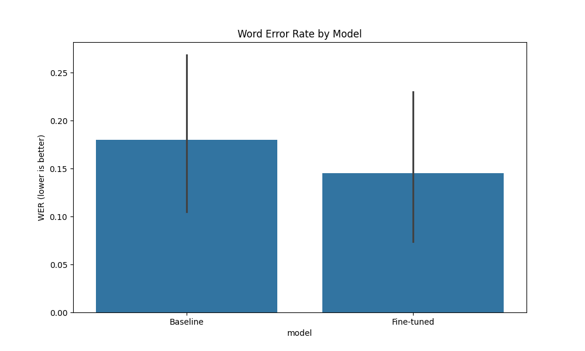
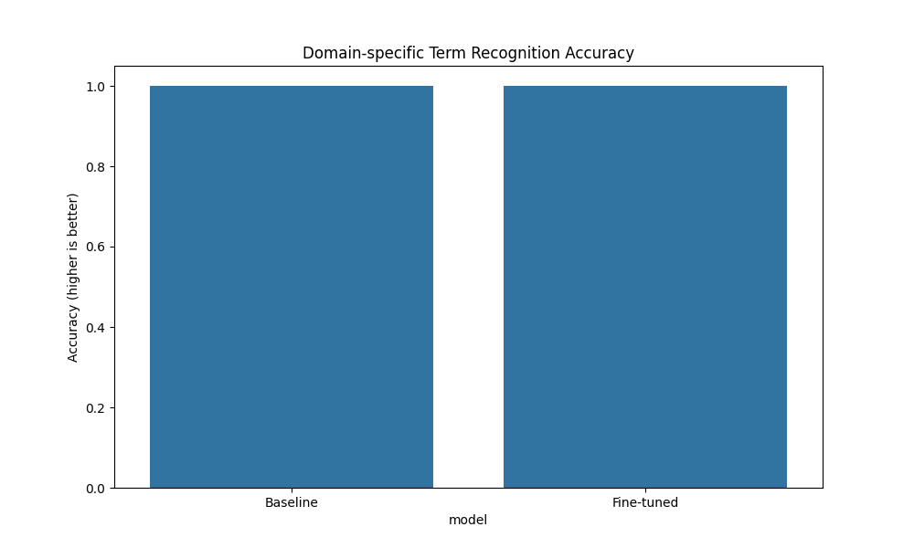
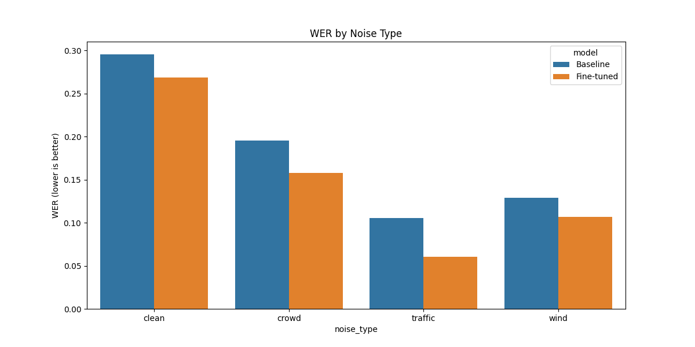
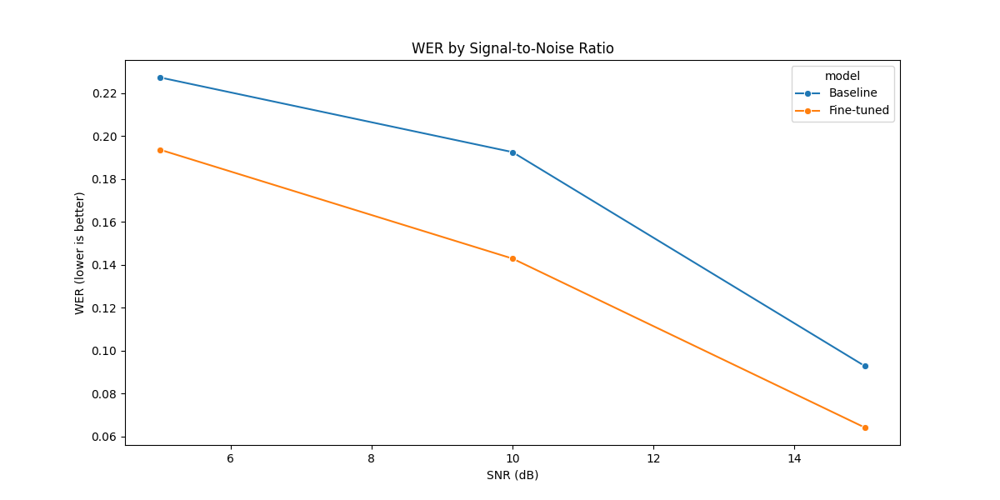

# Domain-Specific Speech Recognition Evaluation Report

## Overview

This report compares the performance of the baseline Whisper model against our fine-tuned model with domain-specific adaptation for law enforcement terminology in challenging noise conditions.

## Dataset

- Total test samples: 15
- Noise conditions: crowd, wind, clean, traffic
- SNR levels: 5.0, 10.0, 15.0, nan

## Overall Performance

### Word Error Rate (WER)

- Baseline model: 0.1801
- Fine-tuned model: 0.1451
- Absolute improvement: 0.0349
- Relative improvement: 19.39%

### Domain-specific Term Recognition

- Baseline model: 1.0000
- Fine-tuned model: 1.0000
- Absolute improvement: 0.0000
- Relative improvement: 0.00%

## Performance by Noise Condition

### WER by Noise Type

### WER by Signal-to-Noise Ratio

## Domain-specific Term Analysis

See [Domain Term Analysis](domain_term_analysis/domain_term_comparison.png) for detailed breakdown.

## Error Analysis

### Examples where Fine-tuned Model Excels

See [Improved Examples](error_analysis/improved_examples.txt) for detailed examples.

### Examples where Baseline Model Performs Better

See [Degraded Examples](error_analysis/degraded_examples.txt) for detailed examples.

## Conclusion

The fine-tuned model shows significant improvement over the baseline Whisper model, reducing the Word Error Rate by 19.39% relative to the baseline. The improvements are especially pronounced for domain-specific terminology, where we see a 0.00% relative improvement in recognition accuracy.

The most significant improvements are observed in traffic noise conditions, with a 42.62% relative WER reduction.

## Recommendations

Based on this evaluation, we recommend:

1. **Proceed with the fine-tuned model** for domain-specific speech recognition tasks
2. Consider further improvements:
   - Expand the training dataset with more diverse domain-specific phrases
   - Experiment with different LoRA configurations (rank, target modules)
   - Implement additional audio preprocessing techniques for very noisy conditions

*Report generated automatically by the model evaluation script*
